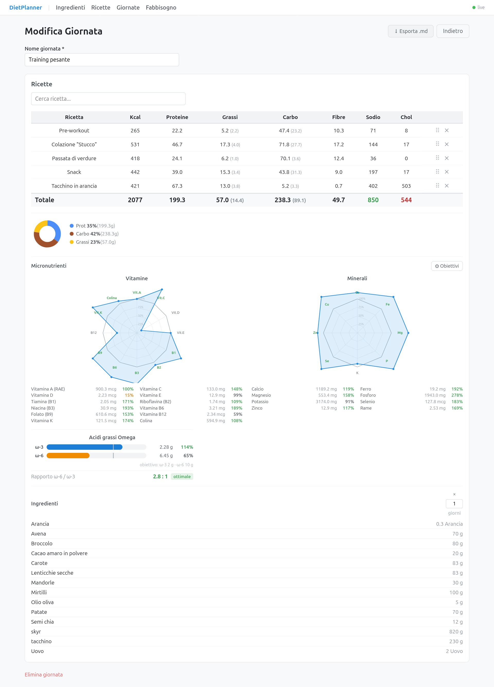
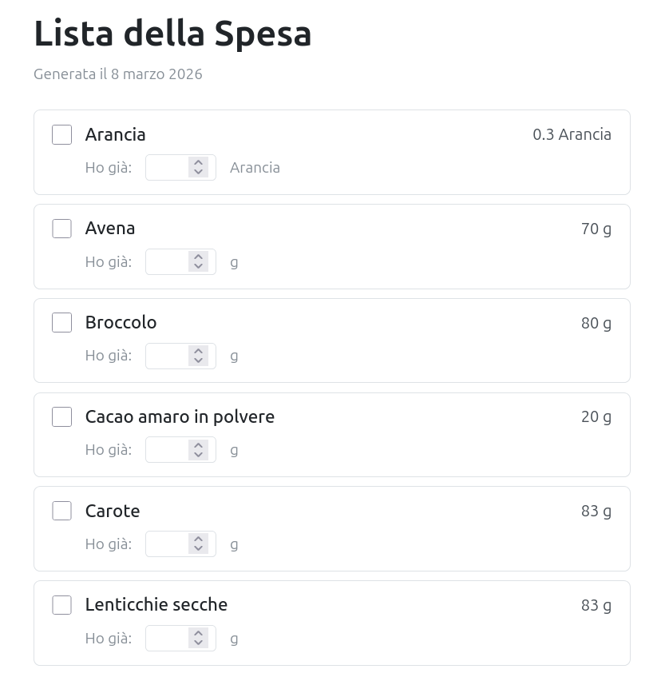

# DietPlanner 2.0

A local web app to plan and track your personal diet. Manage ingredients, build recipes, and compose daily meal plans — with automatic nutritional calculations, micronutrient tracking, and grocery list export.

## Screenshots

| Daily meal plan | Grocery list |
|---|---|
|  |  |

## What it does

### Ingredients
Create a personal food database with full nutritional profiles: macros (kcal, protein, carbs, fat), fiber, sodium, and micronutrients (vitamins, minerals, amino acids, omega-3/6). Ingredients can be imported automatically from [nutritionvalue.org](https://www.nutritionvalue.org) — just paste the URL and the fields are pre-filled.

Each ingredient stores values per 100g, or per unit if the food is naturally measured that way (e.g. "1 egg = 50g").

### Recipes
Compose recipes from your ingredients, specifying quantities in grams or units. The nutritional breakdown is calculated live as you add or change ingredients, showing:
- Macronutrient totals (kcal, protein, carbs, fat) with a visual pie chart
- Spider charts for vitamins and minerals, compared against your personal daily targets
- Omega-3 / omega-6 bars with the ω-6:ω-3 ratio highlighted

Recipes include a free-text preparation field with Markdown support.

### Daily meal plans
Build a day by composing recipes. The app sums all nutritional values across the full day — macros, vitamins, minerals, omega fatty acids — and displays them with the same charts as recipes. You can export any day as a detailed Markdown file with per-recipe and per-ingredient breakdowns.

### Caloric needs calculator
A standalone calculator (no server needed) to estimate your daily caloric needs:
- BMR via Harris-Benedict, multiplied by activity level (TDEE)
- Macro targets in g/kg of body weight
- Calorie presets: surplus (+10/+20%), maintenance, or deficit (−10/−20%)
- Meal distribution across 3 scenarios: rest day, training deficit, training surplus

### Grocery list
Select one or more daily plans and export a consolidated shopping list as an HTML file, with quantities summed across shared ingredients.

## Data storage

All data lives locally as plain Markdown files with YAML frontmatter in the `data/` folder — no database, no cloud, fully offline. Nutritional values are never stored; they are always computed on the fly from ingredients.

## Tech stack

| Layer | Technology |
|---|---|
| Runtime | Bun |
| Frontend | SvelteKit 5 (SPA, adapter-static) |
| Storage | `.md` files with YAML frontmatter |
| Real-time sync | WebSocket (Bun native) + chokidar |

## Getting started

```bash
# Install dependencies
bun install

# Start dev server (backend on :3000, frontend on :5173)
bun dev

# Open in browser
http://localhost:5173
```

For production:

```bash
bun run build   # build frontend
bun start       # serve everything on :3000
```
